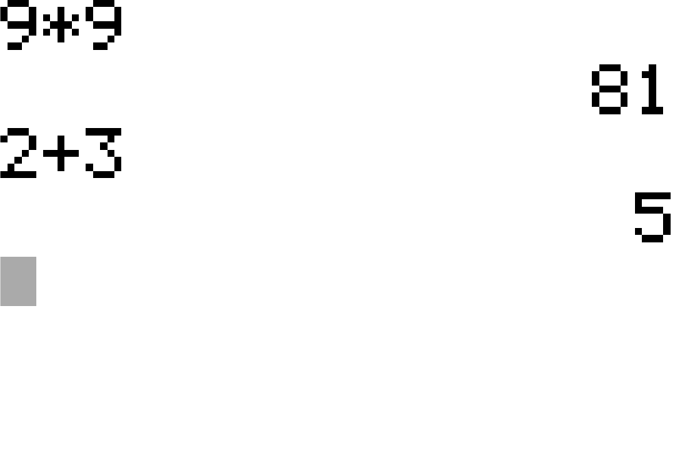

# TI-84 Plus accessibility project

A photorealistic TI-84 Plus skin, a matching keymap, two emulator builds with
high-contrast screens, and a from-scratch macOS emulator — all built for one
student with **Stargardt disease**, who works at up to 10× magnification and
needs strong contrast in mid and low light.



Everything here is for private, non-commercial accessibility use.
**Not for redistribution.**

## What's in the box

| | |
|---|---|
| `skins/` | The delivered skin + keymap PNGs: `TI-84Plus-Official-v2` (daylight/standard), `TI-84Plus-Day` (white screen), `TI-84Plus-Night` (dark), and the shared `TI-84Plus-Keymap`. |
| `macemu/` | **A complete TI-84 Plus emulator for macOS**, written for this project: Z80 core, TI hardware, Cocoa app. See [macemu/README.md](macemu/README.md). |
| `patch_lcd.py` | Patches a *copy* of WabbitEmu.exe so its hard-coded LCD palette becomes black-on-white, white-on-black, or amber-on-black. |
| `windows/HOW TO USE.txt` | Setup notes for the Windows bundle. |
| `layout.py` and friends | The generator: geometry, key legends, the keymap, and a verifier. |
| `WORKLOG.md` | The full engineering log — every decision, measurement and dead end. |

### Deliberately not committed

* **No ROM image.** A TI-84 Plus ROM is TI's copyrighted software; dump your own
  calculator. `.gitignore` blocks `*.rom` so one can't be added by accident.
* **No patched `Wabbitemu.exe`.** `patch_lcd.py` rebuilds them from your own copy
  and refuses to run unless every byte it expects matches.

## Why the skin is generated, not drawn

`layout.py` is the single source of truth: key positions, sizes, colours and
group/bit numbers all come from it, so the skin and the keymap can never drift
apart, and the Mac emulator reads the same numbers (`macemu/gen_keytable.py`).
A diffusion pass contributes surface texture only — as a luminance high-pass,
edge-guarded, so no key can move or change colour.

```bash
python3 keymap.py    skins/TI-84Plus-Keymap.png 3.25
python3 composite.py skins/TI-84Plus-Day.png   out/diffusion.png 6.5 --theme day   --half
python3 composite.py skins/TI-84Plus-Night.png out/diffusion.png 6.5 --theme night --half
python3 verify.py    skins/TI-84Plus-Day.png   skins/TI-84Plus-Keymap.png 3.25
```

The delivered skins are built at scale 6.5 and halved, so `verify.py` and
`keymap.py` take **3.25** as their scale argument.

`verify.py` is a port of WabbitEmu's own skin loader plus the project's rules —
111 checks, including the one that matters most on a laptop: **a source image
taller than about 1880 px makes WabbitEmu's window bigger than the screen**,
because its minimum window size is half the skin's pixel size.

## The two ways to run it

**Windows** — WabbitEmu with a custom skin, plus optional patched copies for the
white or dark screen. See `windows/HOW TO USE.txt`.

**macOS** — this project's own emulator, because WabbitEmu is Windows-only:

```bash
cd macemu && ./build.sh && open "build/TI-84 Plus.app"
```

Day / Night / Night-Amber themes switch the skin and the LCD palette together,
**Screen Only** (⌘0) fills the window with the 96×64 screen for magnification,
and the window scales down to fit a laptop instead of locking to half the skin's
pixel size. Its Z80 core passes all 67 `zexdoc` tests.
